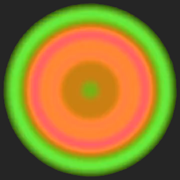

# GENERATIVE ART

+ **[Graphics Samples](http://www.fleen.org/samples)**
+ **[Poster Images](http://www.fleen.org/poster-images)**
+ **[Graphics Archive](https://github.com/johnalexandergreene/FleenGraphics)**
+ **[Videos (STROBE HAZARD!)](https://vimeo.com/user50769355/videos)**
+ **[Source @ Github](https://github.com/johnalexandergreene)**
+ **[GENERATIVE ART FORUM @ reddit.com/r/generative](http://reddit.com/r/generative)**

---

## FORSYTHIA

A language for manipulating 2D geometry, made of geometric diagrams.

+ **[Forsythia Spinner 2017-11-01, High Quality Copy](https://www.dropbox.com/s/mhea9k58km466ic/forsythiaspinner_2017_11_01_720p_30fps.mp4?dl=1)**
+ **[Grammar Editor](https://github.com/johnalexandergreene/Forsythia/tree/master/app/grammarEditor)**
+ **[Grammar Editor Video Walkthrough](https://github.com/johnalexandergreene/Forsythia/raw/master/app/grammarEditor/bin/grammareditorwalkthrough_2017_05_12_how_to_make_a_simple_grammar.ogv)**
+ **[A nice composition generator. It does an infinite slideshow and exports big PNGs for posters. It's a java JAR file. Run it like this : java -jar fcg000.jar](https://www.dropbox.com/s/u9tjljx4wlh1nru/fcg000.jar?dl=1)**
+ **[A paper on Nesting Kisrhombille Tessellation Based Geometry and Forsythia Fractal](https://github.com/johnalexandergreene/Geom_Kisrhombille/blob/master/README.md)**
+ **[Kisrhombille Geometry Source @ Github](https://github.com/johnalexandergreene/Geom_Kisrhombille)**
+ **[Forsythia Fractal Source @ Github](https://github.com/johnalexandergreene/Forsythia)**

---

## CLOUDED PLAIN

+ **[cp_test0014_refinesound_014_nice STROBE HAZARD @ Vimeo](https://vimeo.com/312196135)**
+ **[cloudedplain_ground_uniform_strobe_fancymagic004 HQ DOWNLOAD !!STROBE HAZARD!!](https://www.dropbox.com/s/ak3lqzlaxj5ngwq/002_720p_squaresweeper_roaring_condiments_evenniceraudio.mkv?dl=1)**
+ **[Ten Million Ants Scream Right Now HQ DOWNLOAD !!STROBE HAZARD!!](https://www.dropbox.com/s/4e8zhaur4h3i16c/720p_boxsweeper_ten_million_ants_scream_right_now.mkv?dl=1)**
+ **[Roaring Condiments HQ DOWNLOAD !!STROBE HAZARD!!](https://www.dropbox.com/s/ak3lqzlaxj5ngwq/002_720p_squaresweeper_roaring_condiments_evenniceraudio.mkv?dl=1)**
+ **[More clouded plain videos](https://vimeo.com/user50769355/videos)**
+ **[Clouded Plain Source @ Github](https://github.com/johnalexandergreene/CloudedPlain)**

---

## WHELMER

+ **[ULTIMATE STROBE HAZARD @ Vimeo](https://vimeo.com/308956882)**
+ **[whelmer46a_5m - HQ DOWNLOAD - !!STROBE!!](https://www.dropbox.com/s/6t9skr0ua4le5ma/whelmer46a_5m.mkv?dl=1)**
+ **[whelmer001_asymmetric_2way_handmaderainbowpalette @ Vimeo](https://vimeo.com/303935285)**
+ **[w_test016_strobe2_2_64_simpleperiodic_semisymmetric - HQ DOWNLOAD - !!STROBE!!](https://www.dropbox.com/s/80dzvb0e6x0t481/w_test016_strobe2_2_64_simpleperiodic_semisymmetric.mkv?dl=1)**
+ **[w_test018_periodic_asymmetric_2_2_strobe_veryverynice - HQ DOWNLOAD - !!STROBE!!](https://www.dropbox.com/s/gwbbf5c7rql737j/w_test018_periodic_asymmetric_2_2_strobe_veryverynice.mkv?dl=1)**
+ **[Jubilex @ Vimeo !!STROBE](https://vimeo.com/305281293)**
+ **[Jubilex - HQ DOWNLOAD - !!STROBE!!](https://www.dropbox.com/s/g1gi545lsywb4vf/w_test21_moreprimitivesound_jubilex.mkv?dl=1)**
+ **[w_test25_asymmetric_periodic_720x720x120s_60fps.mkv - HQ DOWNLOAD - !!STROBE!!](https://www.dropbox.com/s/crkp35iltsec3bj/w_test25_asymmetric_periodic_720x720x120s_60fps.mkv?dl=1)**
+ **[w_test24_asymmetric_periodic.mkv - HQ DOWNLOAD - !!STROBE!!](https://www.dropbox.com/s/9sxutjalka76isf/w_test24_asymmetric_periodic.mkv?dl=1)**
+ **[w_test23_soundtest_soundusescellstripquery_asymmetric_nonperiodic_GOOD_LONG.mkv - HQ DOWNLOAD - !!STROBE!!](https://www.dropbox.com/s/57ol43ws5f5vuor/w_test23_soundtest_soundusescellstripquery_asymmetric_nonperiodic_GOOD_LONG.mkv?dl=1)**
+ **[w_test23_soundtest_soundusescellstripquery_asymmetric_nonperiodic_GOOD.mkv - HQ DOWNLOAD - !!STROBE!!](https://www.dropbox.com/s/7ywg8y0wpmvt0ki/w_test23_soundtest_soundusescellstripquery_asymmetric_nonperiodic_GOOD.mkv?dl=1)**

---

## HAIRBALL

+ **[sample](https://www.dropbox.com/s/fhx5m7kh9akeuxb/writhingchoad_small.gif?dl=1)**
+ **[code](https://github.com/johnalexandergreene/Bread/tree/master/app/hairball)**

